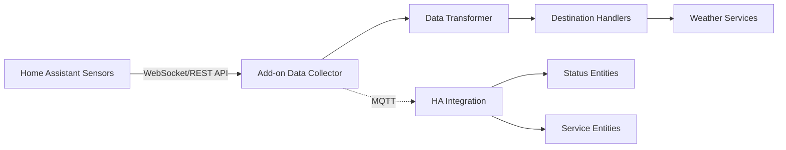

# Home Assistant Weather Station Forwarder Add-on Plan

## Executive Summary

This document outlines a comprehensive plan to transform the existing Weather Station Forwarder (currently a Google Apps Script application) into a Home Assistant add-on. The add-on will allow users to select Home Assistant sensors as data sources and forward weather data to multiple weather services.

## Architecture Recommendation

After analyzing Home Assistant's architecture and existing weather station add-ons, I recommend implementing this as a **Home Assistant Add-on with an accompanying Integration**. This hybrid approach provides the best user experience and follows established patterns in the Home Assistant ecosystem.

### Why Add-on + Integration?

1. **Add-on Component**: Handles the heavy lifting of data collection, transformation, and forwarding to external services
2. **Integration Component**: Provides the configuration UI through Home Assistant's native config flow and creates service entities for control

This pattern is successfully used by projects like ESPHome, Zigbee2MQTT, and WeatherFlow2MQTT.

## Detailed Architecture

### 1. Add-on Structure

```
weather-station-forwarder/
├── config.yaml              # Add-on metadata and configuration schema
├── Dockerfile              # Container definition
├── run.sh                  # Startup script
├── icon.png               # Add-on icon
├── logo.png               # Add-on logo
├── README.md              # Documentation
└── rootfs/
    └── usr/
        └── bin/
            └── weather-forwarder/
                ├── main.py           # Main application
                ├── config.py         # Configuration handler
                ├── sources/          # Data source implementations
                │   ├── __init__.py
                │   └── homeassistant.py
                ├── destinations/     # Destination implementations
                │   ├── __init__.py
                │   ├── wunderground.py
                │   ├── windy.py
                │   ├── pwsweather.py
                │   ├── weathercloud.py
                │   ├── openweathermap.py
                │   ├── windguru.py
                │   ├── wow.py
                │   └── cwop.py
                └── utils/            # Utility functions
                    ├── __init__.py
                    ├── conversions.py
                    └── mqtt.py
```

### 2. Configuration Schema

The add-on will use a two-tier configuration approach:

#### config.yaml (Add-on Definition)
```yaml
name: "Weather Station Forwarder"
version: "1.0.0"
slug: "weather_station_forwarder"
description: "Forward Home Assistant weather data to multiple weather services"
arch:
  - armhf
  - armv7
  - aarch64
  - amd64
  - i386
startup: application
boot: auto
ports:
  8099/tcp: 8099
ports_description:
  8099/tcp: Web interface (optional)
options:
  mqtt_host: null
  mqtt_port: 1883
  mqtt_username: null
  mqtt_password: null
  update_interval: 300
  stations: []
schema:
  mqtt_host: str?
  mqtt_port: port
  mqtt_username: str?
  mqtt_password: password?
  update_interval: int(60,3600)
  stations:
    - name: str
      enabled: bool
      sensors:
        temperature: str?
        humidity: str?
        pressure: str?
        wind_speed: str?
        wind_direction: str?
        rain_rate: str?
        rain_daily: str?
        uv_index: str?
        solar_radiation: str?
      destinations:
        - type: list(wunderground|windy|pwsweather|weathercloud|openweathermap|windguru|wow|cwop)
          enabled: bool
          config: dict
```

### 3. User Configuration Flow

The add-on will provide configuration through multiple interfaces:

#### A. Initial Setup (Add-on Configuration)
1. User installs the add-on from the Home Assistant Add-on Store
2. Basic MQTT configuration is set in the add-on configuration panel
3. Add-on starts and connects to Home Assistant via MQTT

#### B. Station Configuration (Web UI)
The add-on will provide an optional web interface on port 8099 for detailed configuration:

```
Weather Station Forwarder Configuration
├── Dashboard (overview of all stations and their status)
├── Stations
│   ├── Add Station
│   │   ├── Name
│   │   ├── Sensor Mapping (dropdown selectors for each weather parameter)
│   │   └── Save
│   └── [Station Name]
│       ├── Edit Sensors
│       ├── Destinations
│       │   ├── Wunderground
│       │   │   ├── Enable/Disable
│       │   │   ├── Station ID
│       │   │   └── API Key
│       │   ├── Windy.com
│       │   │   ├── Enable/Disable
│       │   │   ├── API Key
│       │   │   └── Station ID
│       │   └── [Other destinations...]
│       └── Delete Station
└── Settings
    ├── Update Interval
    ├── Units (Metric/Imperial)
    └── Advanced Options
```

#### C. Alternative: Config Flow Integration
For a more integrated experience, we could also create a companion integration that provides:
- Config flow for station setup
- Service entities for control (start/stop forwarding)
- Sensor entities for monitoring (last update time, error count, etc.)

### 4. Data Flow



### 5. Sensor Mapping Strategy

The add-on will use Home Assistant's entity selector to allow users to map their existing sensors:

```python
sensor_mapping = {
    "temperature": {
        "name": "Temperature",
        "device_class": "temperature",
        "unit_of_measurement": ["°C", "°F"],
        "required": True
    },
    "humidity": {
        "name": "Humidity",
        "device_class": "humidity",
        "unit_of_measurement": ["%"],
        "required": True
    },
    "pressure": {
        "name": "Barometric Pressure",
        "device_class": "pressure",
        "unit_of_measurement": ["hPa", "mbar", "inHg"],
        "required": False
    },
    # ... additional sensors
}
```

### 6. Communication with Home Assistant

The add-on will communicate with Home Assistant through multiple channels:

1. **Home Assistant API**: For reading sensor values
2. **MQTT**: For status updates and control commands
3. **WebSocket**: For real-time sensor updates (optional)

### 7. Error Handling and Monitoring

The add-on will provide comprehensive monitoring:

1. **Status Dashboard**: Shows the health of each station and destination
2. **Error Logging**: Detailed logs available in the add-on log viewer
3. **MQTT Status Topics**: For integration with Home Assistant automations
4. **Retry Logic**: Automatic retries for failed uploads with exponential backoff

## Implementation Phases

### Phase 1: Core Add-on Development
1. Create basic add-on structure
2. Implement Home Assistant sensor reading
3. Port existing destination handlers from Google Apps Script
4. Basic configuration via add-on options

### Phase 2: Web UI Development
1. Create web interface for configuration
2. Implement station management
3. Add real-time status monitoring
4. Create backup/restore functionality

### Phase 3: Integration Development
1. Create companion Home Assistant integration
2. Implement config flow for station setup
3. Add service entities for control
4. Create sensor entities for monitoring

### Phase 4: Advanced Features
1. Add support for calculated sensors (dewpoint, heat index, etc.)
2. Implement data validation and quality checks
3. Add support for multiple units and conversions
4. Create automation blueprints for common scenarios

## Technology Stack

- **Programming Language**: Python 3.11+
- **Web Framework**: Flask or FastAPI (for web UI)
- **MQTT Library**: paho-mqtt
- **Configuration**: YAML + JSON
- **Container Base**: Home Assistant base images
- **Frontend**: HTML/CSS/JavaScript (vanilla or Vue.js)

## Benefits of This Approach

1. **Native Integration**: Feels like a natural part of Home Assistant
2. **Flexible Configuration**: Users can map any sensor, not just weather station integrations
3. **Multi-Station Support**: Can forward data from multiple "virtual" weather stations
4. **Service Agnostic**: Works with any sensor source in Home Assistant
5. **Easy Updates**: Add-on updates are managed through Home Assistant
6. **Backup Integration**: Configuration is included in Home Assistant backups

## Example Use Cases

1. **Aggregate Multiple Sensors**: Combine temperature from one device, humidity from another
2. **Calculated Values**: Use Home Assistant templates for derived values
3. **Redundancy**: Forward the same data to multiple services
4. **Privacy Control**: Choose which data to share with which service

## Migration Path from Google Apps Script

For existing users:
1. Export configuration from Google Apps Script
2. Import into Home Assistant add-on
3. Map existing data sources to Home Assistant sensors
4. Verify destination configurations
5. Enable forwarding

## Conclusion

This hybrid add-on/integration approach provides the most flexibility and best user experience for a Home Assistant Weather Station Forwarder. It leverages Home Assistant's strengths while maintaining the powerful forwarding capabilities of the original solution.